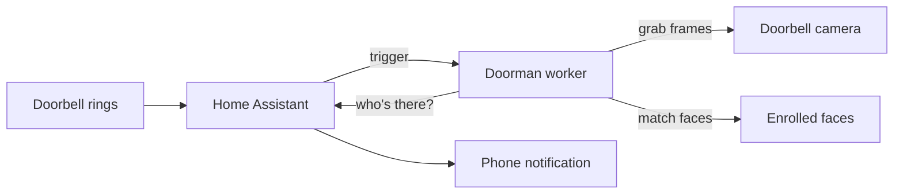

# Doorman

**Self-hosted AI face recognition for your smart doorbell.**

Most doorbells tell you someone rang. Doorman tells you who. When the bell rings, it grabs frames
from the camera, runs on-device AI inference against enrolled faces, and sends a named alert through
[Home Assistant](https://www.home-assistant.io/). For example: _"Alice is at the door"_ or _"Unknown
visitor."_

Everything runs on your own hardware. No cloud APIs, no monthly fees, no sending video to a third
party.

---

## How it works



1. **Ring:** Home Assistant detects the doorbell press and calls Doorman.
2. **Grab:** Doorman opens the camera stream, pulls a handful of frames, and picks the best face
   shot.
3. **Recognize:** An on-device ML model compares the face against people you've enrolled.
4. **Notify:** Results go back to Home Assistant, which sends the alert to your phone.

Recognition runs **only when the bell rings**, not 24/7 surveillance.

---

## What I built

| Area            | Highlights                                                                                                                                              |
| --------------- | ------------------------------------------------------------------------------------------------------------------------------------------------------- |
| **ML pipeline** | Face detection and matching with [InsightFace](https://github.com/deepinsight/insightface) on a local GPU; CLAHE preprocessing for porch/night lighting |
| **Backend**     | Python worker (FastAPI): RTSP ingest, gallery management, recognition API, HA webhook notify                                                            |
| **Web UI**      | SvelteKit enroll app with guided pose capture from the doorbell stream or phone camera                                                                  |
| **Ops**         | Docker Compose deploy to a home GPU server, HTTPS for the enroll UI, health checks, integration tests against real doorbell footage                     |
| **Privacy**     | Faces and embeddings stay on disk at home. No external recognition service.                                                                             |

---

## Tech stack

| Layer      | Tools                                     |
| ---------- | ----------------------------------------- |
| ML         | InsightFace, ONNX Runtime (GPU), OpenCV   |
| Backend    | Python 3.11, FastAPI, Pydantic            |
| Frontend   | SvelteKit, TypeScript                     |
| Infra      | Docker Compose, Caddy (TLS), NVIDIA CUDA  |
| Smart home | Home Assistant (webhook trigger + notify) |
| Tooling    | Bun, pytest, Ruff, Prettier, Husky        |

---

## Project status

Core pipeline is working end-to-end:

- Enroll faces through a web UI (doorbell or phone camera)
- Recognize visitors on demand from the doorbell RTSP stream
- POST results to a Home Assistant webhook

Active work: wiring the doorbell press automation in Home Assistant for fully hands-off alerts. See
[WORKLOG.md](WORKLOG.md) for phase tracking.

---

## Repo layout

```
docs/            product spec, enrollment guide, homelab notes
worker/          Python recognition service + Docker image
  stream.py      on-demand RTSP frame grab
  recognize.py   detect + match against enrolled gallery
  enroll_web.py  enroll API and doorbell preview
web/             SvelteKit UI → served at /enroll
scripts/         deploy, test, and dev helpers
```

---

## Getting started (developers)

**Prerequisites:** Bun, Python 3.11, Docker (for GPU inference). A Reolink (or RTSP) doorbell and
Home Assistant are assumed for production use.

```bash
bun install && bun setup
cd worker && cp .env.example .env   # set STREAM_URL for local RTSP smoke test
bun run test
```

| Command                    | Purpose                                   |
| -------------------------- | ----------------------------------------- |
| `bun run test`             | Unit tests (InsightFace mocked on Mac)    |
| `bun run test:integration` | GPU fixture tests on a remote Docker host |
| `bun run build:web`        | Build the enroll UI                       |
| `bun run deploy`           | Rsync + Docker rebuild on homelab         |
| `bun play-stream`          | RTSP smoke test (`-- -v` for verbose)     |

Mac is for fast edit/test loops; GPU recognition runs in Docker on a home server. Deploy when
**code** changes; use the **enroll UI** when **faces** change.

Deploy env vars: `DEPLOY_HOST` (default `homelab`), `DEPLOY_DIR` (default `doorman`). First Docker
build can take 10-15 minutes (CUDA base + vision stack).

---

## Documentation

| Doc                                        | What's inside                                  |
| ------------------------------------------ | ---------------------------------------------- |
| [`docs/spec.md`](docs/spec.md)             | Architecture, HA integration, design decisions |
| [`docs/enrollment.md`](docs/enrollment.md) | Enroll faces via the web UI                    |
| [`docs/homelab.md`](docs/homelab.md)       | GPU server notes and VRAM budget               |
| [`worker/README.md`](worker/README.md)     | Worker modules, env vars, Docker               |

---

## Why this project

I wanted a practical smart-home feature (_who's at the door?_) without depending on a vendor's cloud
or subscription. Doorman let me work through the full loop: camera ingest, GPU inference, enrollment
UX, deployment, and home-automation integration, with privacy as a hard constraint.
