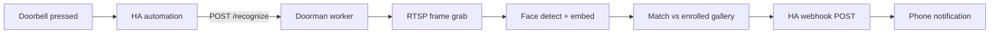

# Doorman — product & technical spec

**Version:** v1 draft · **Status:** RTSP ingest working; recognition not implemented

## Problem

When someone rings the Reolink doorbell, you want to know **who** is there — family by name, or an
unknown visitor — without opening the app every time.

## Goal (v1)

On **doorbell ring**, grab a few frames from the doorbell RTSP stream, **recognize enrolled family
faces**, and POST results to a **Home Assistant webhook**. HA sends the phone notification (names,
unknown count, optional snapshot).

Keep the worker stateless per event: enroll faces from photos on disk; no database.

## Out of scope (v1)

- Continuous yard / curb monitoring
- Person tracking or danger-zone polygons
- Cloud face APIs (AWS Rekognition, etc.)
- Automatic guest enrollment from a single visit

## Inputs

| Input      | Detail                                                      |
| ---------- | ----------------------------------------------------------- |
| Trigger    | Doorbell press (HA automation → HTTP POST to worker)        |
| Video      | Reolink doorbell **RTSP** (grab frames only when triggered) |
| Enrollment | Web UI → homelab `db/manifest.json` + `db/photos/`          |
| Config     | Env vars + face gallery on disk — no DB                     |

**Open questions** (fill before implementation):

- [ ] HA automation: Reolink doorbell entity → webhook to worker
- [ ] HA notify webhook URL (separate from trigger, or same with reply payload)
- [ ] Main vs sub stream for face crops (sub may be enough at 640×480; tune on homelab)
- [ ] Family member list and enrollment photos

## Architecture



### Pipeline (per doorbell event)

1. **Trigger** — HA (or manual curl) POSTs to worker; optional secret header
2. **Grab** — open RTSP, read N frames (e.g. 3–5), pick best frame(s) with visible faces
3. **Detect** — find face bounding boxes in frame
4. **Recognize** — compare embeddings against enrolled family gallery
5. **Notify** — POST JSON to HA webhook, e.g. `{"event":"doorbell","names":["Alice"],"unknown":0}`
6. **Close** — release RTSP; idle until next ring

No always-on inference loop in v1.

## Stack decisions

### Face recognition: InsightFace

| Criterion | InsightFace                         | face_recognition (dlib)     |
| --------- | ----------------------------------- | --------------------------- |
| GPU       | ✓ CUDA on 3060                      | CPU-oriented                |
| Accuracy  | Strong at angles / outdoor doorbell | Good indoors; weaker angles |
| License   | MIT (library); check model terms    | MIT + dlib BSL              |
| Fit       | **v1 choice** for homelab GPU       | Fine for Mac enrollment dev |

Use a compact model pack (e.g. `buffalo_l` or `buffalo_s`) for detect + embed. Gallery = one
embedding per enrolled photo (average or best-match across photos per person).

### Libraries

| Package                  | Role                               |
| ------------------------ | ---------------------------------- |
| `insightface`            | Face detect + embedding            |
| `onnxruntime-gpu`        | Inference backend on homelab       |
| `opencv-python-headless` | RTSP ingest (existing `stream.py`) |
| `requests`               | HA webhook POST                    |
| `fastapi` + `uvicorn`    | HTTP trigger endpoint `/recognize` |

### Why not (for v1)

| Alternative    | Reason to defer                            |
| -------------- | ------------------------------------------ |
| RF-DETR / YOLO | Person bbox, not identity — wrong problem  |
| Frigate face   | Couples to NVR; want a small custom worker |
| CompreFace     | Extra service; less hands-on               |
| Cloud APIs     | Privacy, cost, offline requirement         |

## RTSP notes

Reuses `stream.py` (buffer size 1, single `read()`, reconnect backoff). Frames are pulled **on
demand** when the bell rings — not a 24/7 loop.

- Prefer stable LAN path (homelab wired)
- Substream (~640×480) is OK to start; switch to main stream if face crops are too small
- First frame after open can be slow (warmup); grab multiple frames per event

## Face enrollment

Step-by-step guide: [`docs/enrollment.md`](enrollment.md).

Gallery: `db/manifest.json` + `db/photos/` on homelab → **Enroll now** in the web UI rebuilds
`db/gallery.pkl`. See [`docs/enrollment.md`](enrollment.md).

## Home Assistant integration

Three pieces: `rest_command` in `configuration.yaml`, doorbell automation (HA → worker), notify
automation (worker → HA). Replace hostnames/IPs and entity ids with yours.

### `configuration.yaml`

```yaml
rest_command:
  doorman_recognize:
    url: "https://192.168.x.x:8768/recognize"
    method: POST
    timeout: 30
    verify_ssl: false
```

Port **8768** is **HTTPS only** (Caddy → worker — same as `/enroll`). Use `https://` and your
homelab LAN IP; plain `http://` fails with “Client sent an HTTP request to an HTTPS server.”
`verify_ssl: false` is fine on the LAN — the enroll CA is for phones, not HA.

### Worker `.env` (homelab)

```bash
HA_WEBHOOK_URL=http://192.168.x.x:8123/api/webhook/doorman_notify
```

`doorman_notify` must match `webhook_id` in the notify automation below.

### Trigger (doorbell → worker)

```yaml
# automations.yaml
- id: doorbell_visitor_alert
  alias: Doorbell Visitor Alert
  triggers:
    - trigger: state
      entity_id: binary_sensor.doorbell_visitor
      to: "on"
  actions:
    - action: rest_command.doorman_recognize
  mode: single
```

### Notify (worker → HA)

```yaml
# automations.yaml
- id: doorman_notify_visitor
  alias: Doorman Notify Visitor Names
  triggers:
    - trigger: webhook
      webhook_id: doorman_notify
      allowed_methods:
        - POST
      local_only: true
  actions:
    - action: notify.send_message
      target:
        entity_id: notify.mobile_app_your_phone
      data:
        title: Doorbell
        message: "{{ trigger.json.message }}"
  mode: single
```

Use your phone's notify entity from **Settings → Devices** (e.g. `notify.mobile_app_iphone`).
`notify.notify` is a legacy catch-all — avoid it. Older setups may use
`action: notify.mobile_app_your_phone` with the same `data:` block.

Worker POST example:
`{"event":"doorbell","names":["Alice"],"unknown":0,"message":"Alice is at the door","ts":"..."}`.

`local_only: true` — worker calls HA on the LAN; blocks direct internet triggers. Use `false` only
if HA is reached from outside the home network without Nabu Casa.

## Phases

| Phase             | Deliverable                                          | Where         |
| ----------------- | ---------------------------------------------------- | ------------- |
| **0 — RTSP**      | `stream.py` + `play_stream` smoke test               | Mac + homelab |
| **1 — Recognize** | Enroll gallery + detect/match on still or RTSP       | Homelab GPU   |
| **2 — Integrate** | `/recognize` HTTP + HA webhook notify                | Homelab       |
| **3 — Ship**      | Docker + `bun run deploy` + `/health` + doorbell E2E | `~/doorman`   |
| **4 — Tune**      | Thresholds, stream choice, FN/FP on real rings       | Ongoing       |

## Backlog (post-v1)

| Feature               | Needs                                       |
| --------------------- | ------------------------------------------- |
| Guest enrollment      | Same gallery layout; optional “guest” label |
| Unknown face snapshot | Save crop to `config/unknown/` for review   |
| Multi-face per ring   | List all names + unknown count in one alert |
| Active hours / DND    | HA-side only                                |

## Shared homelab GPU

See [`homelab.md`](homelab.md). InsightFace + small ONNX model is typically **&lt;1 GB VRAM** —
comfortable next to other GPU services on the 3060.

## Development environments

| Machine                | Role                   | What runs here                                 |
| ---------------------- | ---------------------- | ---------------------------------------------- |
| **Dev machine (Mac)**  | Edit, lint, unit tests | pytest, RTSP smoke test (`bun play-stream`)    |
| **Homelab (RTX 3060)** | GPU + prod             | InsightFace, live RTSP on ring, Docker, HA E2E |

Mac does not need CUDA for day-to-day plumbing tests. Face enrollment and recognition integration
run on homelab.

## Deploy pattern

| Step     | Action                                               |
| -------- | ---------------------------------------------------- |
| Code     | Mac — `bun run test`, `bun lint`                     |
| GPU test | Homelab — web UI enroll + `curl POST /recognize`     |
| Deploy   | `bun run deploy` → rsync code to `homelab:~/doorman` |
| Faces    | Web UI at `/enroll` (not rsync'd from Mac)           |
| Secrets  | `~/doorman/.env` only (RTSP, HA webhooks)            |

## Acceptance criteria (v1)

- [ ] Doorbell press triggers recognition within ~5 s end-to-end
- [ ] Enrolled family member at door → HA notification with their name(s)
- [ ] Unknown face → notification indicates unknown visitor
- [ ] No RTSP connection left open between doorbell events
- [ ] Adding a guest via new photos + re-enroll updates recognition
